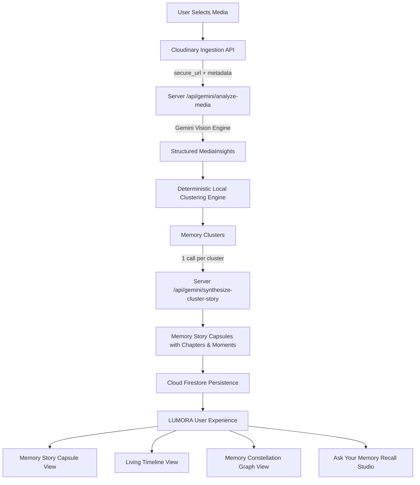

# LUMORA
## Every Moment, Illuminated.

> **Pixels to Products — Cloudinary AI Hackathon 2026**  
> **Track:** Track 3 — Your Media-Savvy Startup  
> **Team:** Zyphra  

---

LUMORA is an AI-powered media intelligence platform that transforms scattered photos and videos into meaningful, searchable memories. 

Traditional galleries organize media around files, folders, and dates, but they do not understand the context, emotional arc, or story behind those moments. Finding a specific highlight often requires endlessly scrolling through thousands of unindexed images.

LUMORA solves this by combining **Cloudinary's media infrastructure**, **Google Gemini's multimodal understanding**, a **deterministic local memory clustering engine**, and **Firebase persistence** to turn uploaded media into connected, interactive Memory Story Capsules.

---

## ✨ What is LUMORA?

LUMORA bridges the gap between unstructured media files and personal human recall. Rather than presenting a flat grid of thumbnails, LUMORA actively understands the visual content, groups related moments into events, and synthesizes cohesive narratives grounded strictly in visual evidence.

With LUMORA, users can:
- **Upload real photos and videos** directly through an optimized Cloudinary pipeline with live upload progress.
- **Understand media using Gemini**, detecting observable scenes, activities, objects, tags, and context.
- **Extract structured Media Insights** without inferring sensitive personal attributes or fabricating facts.
- **Automatically cluster related media** using a local, deterministic similarity scoring engine.
- **Generate Memory Story Capsules** that encapsulate an event with human-readable titles, subtitles, and narrative summaries.
- **Organize stories into logical chapters and key moments**, each backed by verifiable media assets.
- **Explore a Living Timeline** showing chronological progression and cluster transitions.
- **Visualize relationships through a Memory Graph** representing clusters and semantic linkages.
- **Ask questions through Ask Your Memory**, a conversational recall engine that performs cluster-first retrieval and cites media evidence.
- **Experience strict separation between Live Mode and Demo Mode**, ensuring real user data remains private and untainted.

---

## 🎯 The Problem

1. **Volume and Fragmentation:** People capture hundreds of photos and videos during trips, hackathons, and celebrations, only for them to sit scattered across local devices and cloud storage buckets.
2. **Flat Date/Folder Organization:** Standard galleries sort strictly by file creation dates or directory hierarchies, ignoring the narrative context of the event.
3. **Loss of Context:** As time passes, the connection between an early whiteboard diagram, a mid-day coding sprint, and a final stage presentation is lost.
4. **Tedious Manual Retrieval:** Locating a specific highlight requires tedious manual scrolling and searching.
5. **No Conversational Understanding:** Traditional media tools cannot answer natural language questions about what occurred, when it happened, or which media proves it.

---

## 💡 Our Solution

LUMORA implements a structured, multi-stage media intelligence pipeline:

```
User Media (Photos & Videos)
            ↓
   Cloudinary Ingestion (Storage, Transformations, CDN)
            ↓
Gemini Media Understanding (/api/gemini/analyze-media)
            ↓
  Structured Media Insights (Scene, Activity, Objects, Tags)
            ↓
Deterministic Local Clustering (Relevance Scoring Engine)
            ↓
     Memory Clusters (Semantic Event Grouping)
            ↓
Gemini Story Synthesis (/api/gemini/synthesize-cluster-story)
            ↓
  Memory Story Capsules (Summary, Chapters, Key Moments)
            ↓
Firestore Persistence (Private User Ownership & Schema)
            ↓
Multi-Lens Interactive Experience (Story Capsule, Timeline, Graph, Ask)
```

---

## 🚀 Key Features

### 1. Real Media Upload (Cloudinary)
- Direct asynchronous file ingestion to Cloudinary via signed or unsigned upload presets.
- Real-time progress monitoring per asset.
- Live verification of Cloudinary `secure_url`, `public_id`, format, dimensions, duration, and file size.
- Strictly zero placeholder or fake media in Live Mode.

### 2. AI Media Understanding (Gemini Vision)
- Server-side multimodal analysis powered by Google Gemini 3.8 Flash (`@google/genai` SDK).
- Extracts structured `MediaInsight` objects containing:
  - `scene`: The observable physical environment (e.g., workstation, auditorium stage, foyer).
  - `activity`: The action taking place (e.g., prototype testing, keynote presentation, team review).
  - `objects`: Concrete visible elements (e.g., laptops, dual monitors, badges, projection screen).
  - `tags`: Grounded semantic labels.
  - `context`: Narrative context of the capture.
  - `momentType`: Event classification (e.g., arrival, breakthrough, presentation, celebration).
- Guardrails ensure the model never infers identities, emotions as objective facts, or sensitive personal attributes.

### 3. Automatic Memory Clustering
- Deterministic, local scoring engine that groups media assets without sending raw batches to an external LLM for grouping.
- Weights the exact observable signals:
  - **Shared tags** (`+5` similarity score)
  - **Shared activity** (`+4` similarity score)
  - **Same moment type** (`+4` similarity score)
  - **Similar scene** (`+3` similarity score)
  - **Temporal proximity** (`+3` similarity score)
  - **Location / context** (`+3` similarity score)
  - **Shared objects** (`+2` similarity score)
- Automatically isolates outlier assets into a safe `"Unsorted Memory"` cluster if they do not meet confidence thresholds.

### 4. Memory Story Capsules
- Transforms clusters into narrative capsules containing:
  - **Story Title:** Natural human-readable title (e.g., *"Final Presentation"*, *"Hackathon 2026"*).
  - **Subtitle:** Concise descriptive subtitle.
  - **Grounded Summary:** Narrative arc synthesized from cluster insights.
  - **Chapters:** 2–5 structured chapters derived from activity and scene changes.
  - **Key Moments:** Verified milestone cards linking directly to supporting media IDs.
  - **Memory Evidence:** Real Cloudinary media cards with interactive highlight filtering.

### 5. Living Timeline
- Sequential and chronological timeline view with custom 3D ambient canvases.
- Visual cluster flow breadcrumbs showing progression from one milestone to the next.
- Direct playback and inspection for video reels and high-resolution photo assets.

### 6. Memory Graph
- Interactive 2D constellation canvas visualizing relationship networks:
  $$\text{Memory} \longrightarrow \text{Clusters} \longrightarrow \text{Chapters} \longrightarrow \text{Key Moments} \longrightarrow \text{Media Assets}$$
- Primary and secondary nodes with dynamic spatial positioning and category-based color coding.

### 7. Ask Your Memory (Conversational Recall)
- Grounded Q&A interface against personal memory archives.
- **Cluster-First Retrieval:** Identifies relevant clusters and filters candidate moments before invoking Gemini synthesis.
- Answers questions with cited timestamps, confidence levels, follow-up suggestions, and direct media evidence cards.

### 8. Live Mode & Demo Mode Separation
- **Live Mode:** Connects to real user Cloudinary accounts and authenticated Firestore storage. Strictly displays uploaded media and real database records.
- **Demo Mode:** An isolated sandbox presenting curated Hackathon 2026 media, chapters, and constellation data for demonstration without requiring immediate cloud configuration.

---

## 🧠 How the Intelligence Works

```
┌────────────────────────────────────────────────────────────────────────┐
│                        1. MEDIA INGESTION                              │
│  User selects photos/videos → Cloudinary Upload API → CDN Delivery     │
└───────────────────────────────────┬────────────────────────────────────┘
                                    │
┌───────────────────────────────────▼────────────────────────────────────┐
│                      2. MEDIA UNDERSTANDING                            │
│  POST /api/gemini/analyze-media → Gemini multimodal visual analysis    │
│  Produces: scene, activity, objects, tags, momentType, description     │
└───────────────────────────────────┬────────────────────────────────────┘
                                    │
┌───────────────────────────────────▼────────────────────────────────────┐
│                       3. LOCAL CLUSTERING                              │
│  Deterministic similarity matrix evaluates tags (+5), activity (+4),   │
│  momentType (+4), scene (+3), time (+3), location (+3), objects (+2)   │
└───────────────────────────────────┬────────────────────────────────────┘
                                    │
┌───────────────────────────────────▼────────────────────────────────────┐
│                       4. STORY SYNTHESIS                               │
│  POST /api/gemini/synthesize-cluster-story (Strictly 1 call per cluster)│
│  Generates: title, subtitle, summary, chapters (01–04), key moments    │
└───────────────────────────────────┬────────────────────────────────────┘
                                    │
┌───────────────────────────────────▼────────────────────────────────────┐
│                        5. PERSISTENCE                                  │
│  Firestore writes: memories, clusters, storyCapsules, moments, media   │
│  Secured with ownerId user authentication validation                   │
└───────────────────────────────────┬────────────────────────────────────┘
                                    │
┌───────────────────────────────────▼────────────────────────────────────┐
│                        6. RETRIEVAL & LENSES                           │
│  Memory Story Capsule │ Living Timeline │ Memory Graph │ Ask Memory    │
└────────────────────────────────────────────────────────────────────────┘
```

1. **Media Ingestion:** Files are sent to Cloudinary via `FormData` or XMLHttpRequest with progress listeners. Cloudinary stores the file, generates responsive transformations, and returns a verified `secure_url`.
2. **Media Understanding:** The server-side Gemini endpoint inspects the image buffer or Cloudinary URL and produces a structured `MediaInsight` object adhering to strict JSON schemas.
3. **Local Clustering:** `memoryClusteringEngine.ts` processes all media insights locally, computing similarity scores across 7 distinct dimensions to cluster assets without external API overhead.
4. **Story Synthesis:** For each meaningful cluster, Gemini receives only the cluster's media insights, timestamps, and context, generating a grounded story capsule with chapters and moments.
5. **Persistence:** Complete memory documents, subcollections, clusters, and story capsules are written to Google Cloud Firestore under the authenticated user's `ownerId`.
6. **Retrieval:** When interacting with *Ask Your Memory*, `memoryRecallEngine.ts` performs intent analysis and cluster-first candidate scoring before generating answers with verified media evidence.

---

## ☁️ Cloudinary Integration

Cloudinary is the foundational media layer powering LUMORA. It is not used merely as static file storage; it manages the entire media lifecycle from ingestion to delivery and dynamic optimization.

### Implemented Cloudinary Capabilities

- **Cloudinary Upload API:** Client-to-cloud direct uploads via `https://api.cloudinary.com/v1_1/<cloud_name>/<resource_type>/upload` supporting both image and video assets.
- **Upload Progress Monitoring:** Real-time upload percentage tracking using native `xhr.upload.onprogress` events.
- **Metadata Extraction:** Captures and stores Cloudinary asset properties:
  - `secure_url`: HTTPS CDN delivery URL used as the single source of truth for rendering.
  - `public_id`: Unique identifier for asset management and transformations.
  - `resource_type`: Distinguishes between `'image'` and `'video'` pipelines.
  - `format`: Web-native formats (`jpg`, `png`, `mp4`, `webm`).
  - `width` & `height`: Dimensions for responsive aspect-ratio rendering.
  - `bytes`: Asset byte size formatted for user display.
  - `duration`: Video duration in seconds for reel previews.
- **Dynamic Transformation Delivery (`getOptimizedImageUrl`):**
  - Injects `f_auto` for automatic modern format negotiation (WebP/AVIF).
  - Injects `q_auto` for optimal quality compression.
  - Applies responsive resizing (`w_<width>`) and intelligent cropping (`c_fill`, `c_limit`).
- **Media Evidence Visual System:** Every memory story capsule, timeline moment, and conversation turn references real Cloudinary assets with full thumbnail and modal inspection.

---

## 🧠 Google Gemini Integration

LUMORA uses Google Gemini 3.8 Flash via the `@google/genai` TypeScript SDK on the server (`server.ts`). All Gemini API keys remain securely on the backend and are never exposed to client browsers.

### Implemented Server Endpoints

| Endpoint | Method | Description |
| :--- | :---: | :--- |
| `/api/gemini/status` | `GET` | Health check verifying Gemini API availability and configured model. |
| `/api/gemini/analyze-media` | `POST` | Performs multimodal vision analysis on an individual image/video asset to extract structured `MediaInsight` data. |
| `/api/gemini/synthesize-story` | `POST` | Synthesizes an overarching memory narrative and theme graph nodes from a collection of moments. |
| `/api/gemini/synthesize-cluster-story` | `POST` | Generates a grounded Memory Story Capsule for an individual cluster (strictly one synthesis call per cluster). |
| `/api/gemini/ask-memory` | `POST` | Answers natural language questions about personal media with temporal awareness and grounded evidence links. |

### Multimodal Vision & Grounding Principles
- **Strict Structured Outputs:** Gemini calls use `responseMimeType: 'application/json'` and formal JSON schemas (`Type.OBJECT`, `Type.ARRAY`) to ensure deterministic parsing.
- **Zero Hallucination Guardrails:** Prompts strictly instruct the model to ground narrative summaries, chapters, and key moments in observable visual data. It does not invent names, dates, conversations, or external facts.

---

## 🔥 Firebase Integration

LUMORA integrates Firebase for persistent user storage and authentication, enforcing multi-user privacy through owner validation.

### Implemented Firebase Features

- **Firebase Authentication:** Supports Google OAuth popups and anonymous demo authentication with reactive session observation (`onAuthStateChanged`).
- **Cloud Firestore Database Structure:**
  - `memories/{memoryId}`: Primary memory document containing metadata, title, subtitle, cover gradient, mood, and tags.
  - `memories/{memoryId}/media/{mediaId}`: Individual media assets with Cloudinary asset metadata.
  - `memories/{memoryId}/moments/{momentId}`: Timeline moment entries with scene, activity, and tags.
  - `memories/{memoryId}/clusters/{clusterId}`: Memory cluster records with similarity confidence and media IDs.
  - `memories/{memoryId}/clusters/{clusterId}/story/main`: Synthesized Story Capsule with chapters and key moments.
  - `memories/{memoryId}/conversations/{turnId}`: Persisted multi-turn Q&A conversation history for *Ask Your Memory*.
  - `clusters/{clusterId}` & `storyCapsules/{capsuleId}`: Top-level collections for direct cluster queries.
- **Security & Ownership Rules (`firestore.rules`):**
  - Requires `request.auth != null`.
  - Enforces `request.resource.data.ownerId == request.auth.uid` on document creation and read operations.
- **Reconstruction on Refresh:** On page reload, user memories, clusters, story capsules, and previous conversations are reconstructed directly from Firestore.

---

## 🏗️ Architecture



### Technology Stack

- **Frontend:** React 19, TypeScript, Tailwind CSS v4, Motion, Three.js (WebGL ambient canvases), Lucide React.
- **Backend:** Node.js, Express, `tsx`, `@google/genai` TypeScript SDK.
- **Media Infrastructure:** Cloudinary Upload API & Dynamic Transformation CDN.
- **Database & Auth:** Firebase Authentication & Cloud Firestore.
- **Development Tooling:** Vite, ESLint, TypeScript compiler.

---

## 🛠️ Getting Started

### Prerequisites
- Node.js (v18 or higher recommended)
- A Cloudinary account (cloud name and unsigned upload preset)
- A Google Gemini API key
- (Optional) A Firebase project for database persistence and authentication

### 1. Installation
Clone the repository and install dependencies:
```bash
npm install
```

### 2. Environment Configuration
Create a `.env` file from the example template:
```bash
cp .env.example .env
```

Populate the environment variables:
```env
# Server-Side Secrets
GEMINI_API_KEY="your-gemini-api-key"
CLOUDINARY_API_SECRET=""
PORT="3000"

# Client-Side Configuration (safe for browser)
VITE_CLOUDINARY_CLOUD_NAME="your-cloud-name"
VITE_CLOUDINARY_UPLOAD_PRESET="your-upload-preset"

# Firebase Client Configuration (Optional for persistence)
VITE_FIREBASE_API_KEY="your-api-key"
VITE_FIREBASE_AUTH_DOMAIN="your-project.firebaseapp.com"
VITE_FIREBASE_PROJECT_ID="your-project-id"
VITE_FIREBASE_STORAGE_BUCKET="your-project.appspot.com"
VITE_FIREBASE_MESSAGING_SENDER_ID="your-sender-id"
VITE_FIREBASE_APP_ID="your-app-id"
```

*Note: You can also configure your Cloudinary Cloud Name and Upload Preset directly in the application UI during media upload.*

### 3. Running the Development Server
Start the unified full-stack server (Express backend + Vite client middleware):
```bash
npm run dev
```
Open your browser at `http://localhost:3000`.

### 4. Code Quality & Type Check
Verify that there are no TypeScript or compilation errors:
```bash
npm run lint
npm run build
```

---

## 👥 Team Zyphra

Built with passion for the **Pixels to Products — Cloudinary AI Hackathon 2026**.

*LUMORA — Every Moment, Illuminated.*
